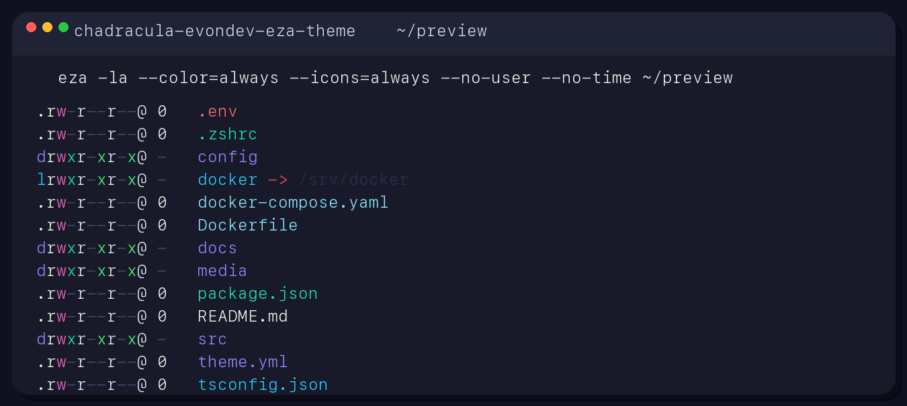

# Chadracula Evondev for eza

A custom `eza` theme based on the `chadracula-evondev` palette, with a few
practical tweaks for terminal readability:

- Symlinks use the stronger cyan from the earlier iteration.
- Symlink targets keep the lighter cyan variant.
- Write permissions use pink to match the Dracula-style treatment.
- Common developer filenames and extensions have explicit overrides.

## Preview



## Install

Copy the theme file into your `eza` config directory:

```sh
mkdir -p ~/.config/eza
cp eza/theme.yml ~/.config/eza/theme.yml
export EZA_CONFIG_DIR="$HOME/.config/eza"
```

Then run `eza` as normal.

## Notes

- The canonical theme file in this repo is [`eza/theme.yml`](eza/theme.yml).
